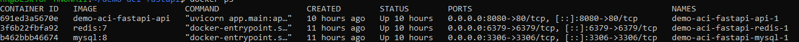
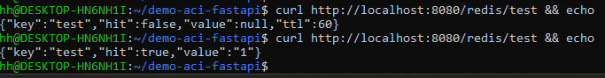
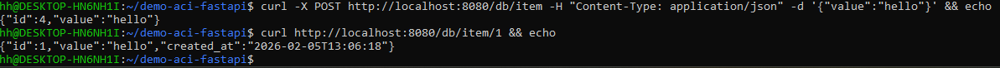

# Demo FastAPI + Redis + MySQL (Docker)

Projekt demonstracyjny, stworzony na potrzeby zajęć z Wirtualizacji i konteneryzacji środowiska IT, na uczelni WSB-NLU:

- FastAPI (Python)
- Redis (cache hit / no-hit)
- MySQL (insert + select)
- Docker + Docker Compose
- Publiczny obraz na DockerHub

## Stack

- API: FastAPI
- Cache: Redis
- Database: MySQL 8
- Containerization: Docker Compose

## Endpointy

### Health
GET /health

### Redis hit / no-hit
GET /redis/{key}

### Insert do bazy
POST /db/item
Body: { "value": "hello" }

### Odczyt z bazy
GET /db/item/{id}

## Uruchomienie lokalne

Start:
    docker compose up -d --build

Test:
    curl http://localhost:8080/health

## DockerHub

Obraz:
    cptmtd/demo-api:latest

## Screenshots

### Docker containers running

### Redis hit / no-hit

### Database insert + select

